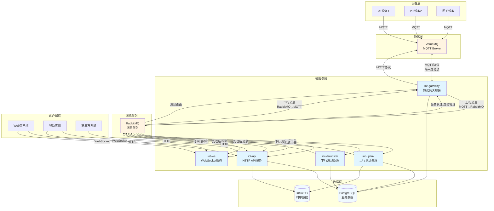

# UMOS IoT Platform - 微服务架构图

本文档描述了 UMOS IoT 平台的微服务架构和5个核心服务的职责与通信关系。

## 架构概览



## 服务职责详解

### 1. iot-gateway (协议网关服务)

**核心职责**: 协议适配和网关管理

**主要功能**:
- MQTT 协议适配，连接 VerneMQ
- 设备认证和授权（验证设备凭证）
- 设备连接管理（连接/断开状态跟踪）
- 协议转换（如未来需要支持其他协议）
- 设备拓扑管理（网关设备和子设备关系）

**通信方式**:
- **MQTT 连接**: 唯一直接连接 VerneMQ 的服务，订阅所有设备相关的 MQTT Topic
- **上行消息流**: VerneMQ → iot-gateway → RabbitMQ (`iot.gateway.uplink.*`) → iot-uplink
- **下行消息流**: iot-downlink → RabbitMQ (`iot.gateway.downlink.*`) → iot-gateway → VerneMQ
- **设备管理**: 通过 RabbitMQ 发布设备连接/断开事件、拓扑更新等
- **数据访问**: 读取设备配置和认证信息（PostgreSQL），更新设备连接状态（PostgreSQL）

**重要约束**: 这是唯一允许直接连接 VerneMQ 的服务，负责所有 MQTT 协议相关的操作

**关键队列**:
- `iot.gateway.device.connect` - 设备连接事件
- `iot.gateway.device.disconnect` - 设备断开事件
- `iot.gateway.topology.update` - 设备拓扑更新

### 2. iot-uplink (上行消息处理服务)

**核心职责**: 处理从设备到平台的所有上行消息

**主要功能**:
- 从 VerneMQ 订阅设备消息（属性上报、事件上报、服务响应）
- 消息解析和验证（验证消息格式、设备权限）
- 物模型映射（将设备特定格式转换为标准物模型格式）
- 消息路由到 RabbitMQ 相应队列
- 时序数据写入 InfluxDB

**通信方式**:
- **输入**: 从 RabbitMQ 订阅上行消息队列（`iot.gateway.uplink.property`, `iot.gateway.uplink.event`, `iot.gateway.uplink.service.reply` 等），这些消息由 iot-gateway 从 VerneMQ 接收并转换后发布
- **输出**: 处理后发布到 RabbitMQ 队列（`iot.uplink.property.report`, `iot.uplink.event.report`, `iot.uplink.service.reply` 等），供其他服务（iot-api、iot-ws）消费
- **数据访问**: 读取物模型定义（PostgreSQL），写入时序数据（InfluxDB）

**重要约束**: 严禁直接连接 VerneMQ 或任何 MQTT Broker，所有上行消息必须通过 iot-gateway 和 RabbitMQ 接收

**关键队列**:
- `iot.uplink.property.report` - 属性上报
- `iot.uplink.event.report` - 事件上报
- `iot.uplink.service.reply` - 服务响应

### 3. iot-downlink (下行消息处理服务)

**核心职责**: 处理从平台到设备的所有下行消息

**主要功能**:
- 从 RabbitMQ 接收下行消息（服务调用、属性设置、命令下发）
- 消息格式转换（将标准格式转换为设备特定格式）
- 路由到 VerneMQ MQTT Topic
- 消息确认和重试机制
- 消息状态跟踪

**通信方式**:
- **输入**: 订阅 RabbitMQ 队列（`iot.downlink.service.call`, `iot.downlink.property.set`, `iot.downlink.command.send` 等），这些消息由其他服务（iot-api、iot-ws）发布
- **输出**: 处理后发布到 RabbitMQ 队列（`iot.gateway.downlink.service`, `iot.gateway.downlink.property.set`, `iot.gateway.downlink.command` 等），供 iot-gateway 消费并转发到 VerneMQ
- **数据访问**: 读取物模型定义（PostgreSQL），记录消息状态（PostgreSQL）

**重要约束**: 严禁直接连接 VerneMQ 或任何 MQTT Broker，所有下行消息必须通过 RabbitMQ 发送给 iot-gateway

**关键队列**:
- `iot.downlink.service.call` - 服务调用
- `iot.downlink.property.set` - 属性设置
- `iot.downlink.command.send` - 命令下发

### 4. iot-api (HTTP API 服务)

**核心职责**: 处理所有 HTTP RESTful API 请求

**主要功能**:
- 设备管理 API（设备注册、查询、更新、删除）
- 物模型管理 API（物模型定义、查询、更新）
- 业务逻辑 API（用户管理、组织管理、权限管理）
- 用户认证授权（JWT Token 验证、权限检查）
- API 版本管理

**通信方式**:
- **输入**: 接收 HTTP 请求（GET、POST、PUT、DELETE）
- **输出**: 返回 HTTP 响应（JSON 格式）
- **内部通信**: 通过 RabbitMQ 与其他服务通信
  - 发布消息到其他服务（如 `iot.downlink.service.call`）
  - 订阅其他服务的响应（如 `iot.api.device.query.response`）
- **数据访问**: 直接访问 PostgreSQL（业务数据）、InfluxDB（时序数据查询）

**关键队列**:
- `iot.api.device.manage` - 设备管理请求
- `iot.api.thingmodel.manage` - 物模型管理请求
- `iot.api.business.*` - 业务逻辑请求

### 5. iot-ws (WebSocket 服务)

**核心职责**: 处理所有 WebSocket 连接和实时消息推送

**主要功能**:
- WebSocket 连接管理（连接建立、维持、断开）
- 向客户端推送实时消息（设备状态变化、事件通知、服务响应等）
- 接收客户端通过 WebSocket 发送的消息
- 连接与用户的绑定关系管理

**通信方式**:
- **输入**: WebSocket 连接，客户端消息
- **输出**: WebSocket 推送消息
- **内部通信**: 
  - 订阅 RabbitMQ 队列接收需要推送的消息（如 `iot.ws.push.device.status`, `iot.ws.push.event`）
  - 发布客户端消息到 RabbitMQ（如 `iot.ws.client.message`）
- **数据访问**: 不直接访问数据库，所有数据通过 RabbitMQ 消息获取

**关键队列**:
- `iot.ws.push.device.status` - 推送设备状态变化
- `iot.ws.push.event` - 推送事件通知
- `iot.ws.push.service.response` - 推送服务响应
- `iot.ws.client.message` - 客户端消息

## 消息流向示例

### 场景1: 设备属性上报

```
设备 → VerneMQ → iot-gateway → RabbitMQ (iot.gateway.uplink.property)
                                    ↓
                            iot-uplink → RabbitMQ (iot.uplink.property.report)
                                    ↓
                            iot-api (查询处理)
                            iot-ws (推送给客户端)
                                    ↓
                            InfluxDB (存储时序数据)
```

### 场景2: 服务调用（通过 HTTP API）

```
客户端 → iot-api (HTTP请求) → RabbitMQ (iot.downlink.service.call)
                                            ↓
                                    iot-downlink → RabbitMQ (iot.gateway.downlink.service)
                                            ↓
                                    iot-gateway → VerneMQ → 设备
                                            ↓
                                    VerneMQ → iot-gateway → RabbitMQ (iot.gateway.uplink.service.reply)
                                            ↓
                                    iot-uplink → RabbitMQ (iot.uplink.service.reply)
                                            ↓
                                    iot-api → HTTP响应
                                    iot-ws → WebSocket推送
```

### 场景3: 实时事件推送

```
设备 → VerneMQ → iot-gateway → RabbitMQ (iot.gateway.uplink.event)
                                    ↓
                            iot-uplink → RabbitMQ (iot.uplink.event.report)
                                    ↓
                            iot-ws → WebSocket推送 → 客户端
                            iot-api → 业务逻辑处理
```

## 服务间通信规范

### RabbitMQ 队列命名规范

格式: `iot.{service}.{action}`

**网关相关队列**（iot-gateway 与其他服务通信）:
- `iot.gateway.uplink.property` - 网关接收的属性上报（从 VerneMQ）
- `iot.gateway.uplink.event` - 网关接收的事件上报（从 VerneMQ）
- `iot.gateway.uplink.service.reply` - 网关接收的服务响应（从 VerneMQ）
- `iot.gateway.downlink.service` - 网关需要下发的服务调用（到 VerneMQ）
- `iot.gateway.downlink.property.set` - 网关需要下发的属性设置（到 VerneMQ）
- `iot.gateway.downlink.command` - 网关需要下发的命令（到 VerneMQ）
- `iot.gateway.device.connect` - 设备连接事件
- `iot.gateway.device.disconnect` - 设备断开事件
- `iot.gateway.topology.update` - 设备拓扑更新

**上行处理队列**（iot-uplink 处理后发布）:
- `iot.uplink.property.report` - 上行属性上报（处理后）
- `iot.uplink.event.report` - 上行事件上报（处理后）
- `iot.uplink.service.reply` - 服务响应（处理后）

**下行处理队列**（其他服务发送给 iot-downlink）:
- `iot.downlink.service.call` - 下行服务调用
- `iot.downlink.property.set` - 下行属性设置
- `iot.downlink.command.send` - 下行命令下发

**API 队列**:
- `iot.api.device.query` - API 设备查询
- `iot.api.device.manage` - API 设备管理

**WebSocket 队列**:
- `iot.ws.push.device.status` - WebSocket 推送设备状态
- `iot.ws.push.event` - WebSocket 推送事件
- `iot.ws.push.service.response` - WebSocket 推送服务响应

### 消息格式规范

所有 RabbitMQ 消息必须包含以下标准字段:

```json
{
  "tid": "transaction-uuid",      // 事务标识
  "bid": "business-uuid",          // 业务标识
  "timestamp": 1234567890123,      // 时间戳（毫秒）
  "service": "iot-api",            // 源服务
  "action": "device.query",        // 操作类型
  "trace_id": "trace-uuid",        // 追踪ID（用于分布式追踪）
  "data": {                        // 消息数据
    // 具体业务数据
  }
}
```

### 消息路由规则

1. **上行消息路由**:
   - `iot.uplink.*` → 所有需要处理上行消息的服务订阅

2. **下行消息路由**:
   - `iot.downlink.*` → iot-downlink 服务订阅

3. **API 请求路由**:
   - `iot.api.*` → iot-api 服务订阅响应队列

4. **WebSocket 推送路由**:
   - `iot.ws.push.*` → iot-ws 服务订阅

## 服务部署要求

### 独立部署
每个服务必须可以独立部署和扩展，支持水平扩展。

### 健康检查
每个服务必须实现 `/health` 和 `/ready` 端点:
- `/health`: 服务健康状态
- `/ready`: 服务就绪状态（依赖服务是否可用）

### 配置管理
- 支持环境变量配置
- 支持配置文件（YAML/JSON）
- 敏感信息通过密钥管理服务

### 优雅关闭
- 接收 SIGTERM 信号后停止接收新请求
- 处理完当前消息后再退出
- 关闭时间不超过 30 秒

## 可观测性

### 指标监控
每个服务必须暴露 Prometheus 指标:
- 请求数（QPS）
- 响应时间（P50, P95, P99）
- 错误率
- 消息队列长度
- 数据库连接池状态

### 日志
- 结构化日志（JSON 格式）
- 包含 trace_id、service、level、message、timestamp
- 日志级别: DEBUG, INFO, WARN, ERROR

### 分布式追踪
- 使用 OpenTelemetry 标准
- 在消息中传递 trace_id
- 追踪跨服务的调用链路

