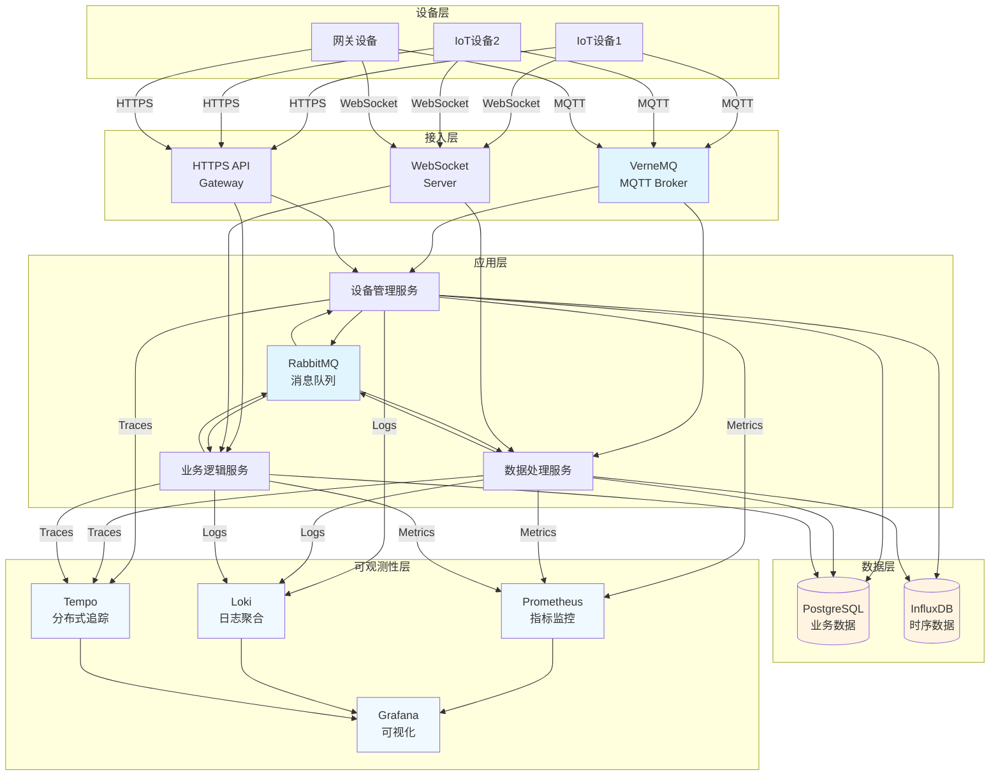

# UMOS IoT Platform - 基础中间件架构图

本文档描述了 UMOS IoT 平台的基础中间件架构和组件关系。

## 架构概览



## 中间件详细说明

### 消息队列层

#### VerneMQ
- **用途**: MQTT 5.0 消息代理
- **职责**: 
  - 接收设备通过 MQTT 协议发送的消息（属性上报、事件上报）
  - 向设备推送服务调用、属性设置等下行消息
  - 支持 QoS 0/1/2 消息质量保证
  - 支持设备认证和授权
- **数据流向**: 设备 ↔ VerneMQ ↔ 应用服务

#### RabbitMQ
- **用途**: 应用内部消息队列
- **职责**:
  - 处理应用服务之间的异步消息传递
  - 实现事件驱动架构
  - 支持任务队列和发布/订阅模式
  - 保证消息的可靠投递
- **数据流向**: 应用服务 → RabbitMQ → 应用服务

### 数据存储层

#### PostgreSQL
- **用途**: 关系型数据库
- **存储内容**:
  - 设备元数据（设备信息、设备拓扑）
  - 物模型定义（Thing Model）
  - 业务数据（用户、组织、权限等）
  - 配置数据
- **特点**: ACID 事务支持，适合结构化数据存储

#### InfluxDB
- **用途**: 时序数据库
- **存储内容**:
  - 设备属性历史数据（传感器数据、状态变化）
  - 设备性能指标
  - 系统监控指标（如果 Prometheus 需要长期存储）
- **特点**: 高写入性能，适合时序数据的高效存储和查询

### 可观测性层

#### Prometheus
- **用途**: 指标监控和告警
- **收集指标**:
  - 系统指标（CPU、内存、磁盘、网络）
  - 应用指标（请求数、响应时间、错误率）
  - 设备指标（在线设备数、消息吞吐量）
  - 中间件指标（VerneMQ、RabbitMQ、数据库连接数等）
- **特点**: Pull 模式采集，PromQL 查询语言

#### Loki
- **用途**: 日志聚合和查询
- **收集日志**:
  - 应用日志（结构化日志）
  - 系统日志
  - 中间件日志
- **特点**: 标签索引，与 Prometheus 标签体系一致

#### Tempo
- **用途**: 分布式追踪
- **追踪内容**:
  - 请求在微服务间的调用链路
  - 设备消息的处理流程
  - 性能瓶颈分析
- **特点**: 支持 OpenTelemetry 标准，与 Prometheus/Loki 集成

#### Grafana
- **用途**: 统一可视化平台
- **功能**:
  - 指标监控 Dashboard（基于 Prometheus）
  - 日志查询和可视化（基于 Loki）
  - 分布式追踪可视化（基于 Tempo）
  - 告警规则配置和通知
- **特点**: 统一的可观测性入口，支持多种数据源

## 数据流向

### 设备数据上报流程
```
设备 → VerneMQ → 应用服务 → InfluxDB (时序数据)
                    ↓
              PostgreSQL (设备元数据更新)
                    ↓
              Prometheus (指标上报)
                    ↓
              Loki (日志记录)
                    ↓
              Tempo (追踪记录)
```

### 服务调用流程
```
应用服务 → RabbitMQ → 应用服务 → VerneMQ → 设备
              ↓
        PostgreSQL (业务数据)
              ↓
        Prometheus/Loki/Tempo (可观测性)
```

### 查询流程
```
用户 → Grafana → Prometheus/Loki/Tempo → 数据展示
```

## 部署建议

### 高可用配置
- **VerneMQ**: 集群模式，支持水平扩展
- **RabbitMQ**: 镜像队列，保证消息高可用
- **PostgreSQL**: 主从复制，读写分离
- **InfluxDB**: 集群模式，数据分片
- **Prometheus**: 联邦模式，长期存储到 InfluxDB
- **Loki**: 分布式部署，多副本
- **Tempo**: 分布式追踪存储
- **Grafana**: 无状态服务，可水平扩展

### 性能优化
- VerneMQ: 根据设备连接数调整连接池大小
- RabbitMQ: 合理设置队列长度和消息 TTL
- PostgreSQL: 索引优化，查询优化
- InfluxDB: 数据保留策略，降采样策略
- Prometheus: 指标采集频率，存储保留时间

## 中间件版本要求

所有中间件必须使用稳定版本，具体版本要求将在部署文档中详细说明。版本升级必须经过测试验证和批准流程。

