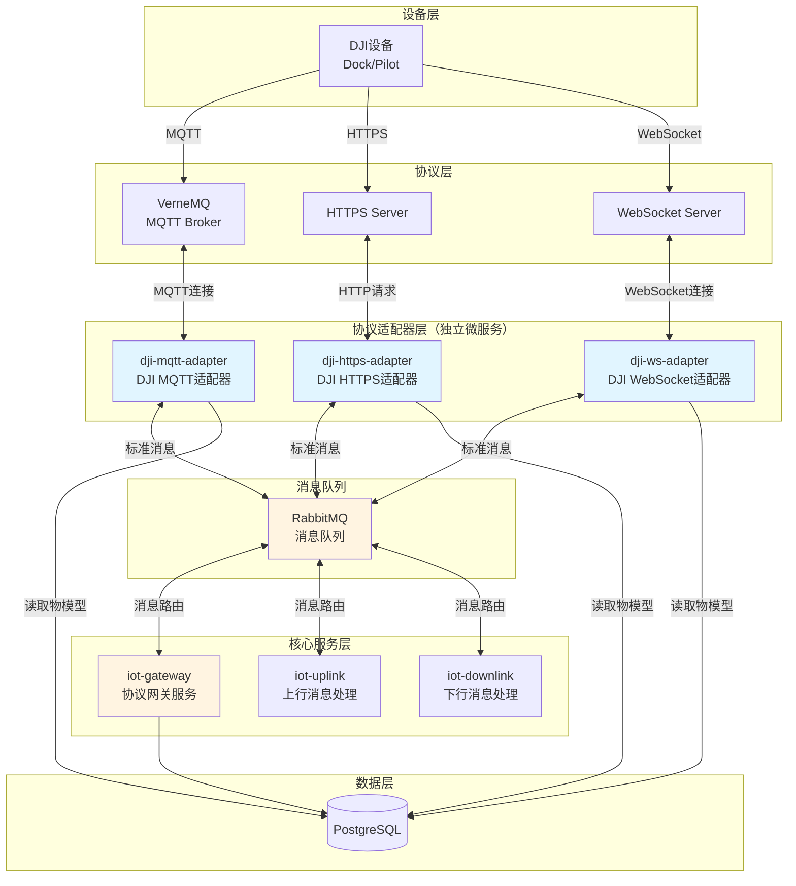

# UMOS IoT Platform - 协议适配器架构设计

本文档描述了协议适配器架构的设计，特别是当每个协议使用独立服务实例时的架构。

## 架构概览（选项 B：每个协议独立服务实例）

## 架构说明

### 服务实例划分

如果选择选项 B（每个协议独立服务实例），架构如下：

**协议适配器服务**（3个独立服务）：
- `dji-mqtt-adapter`: 专门处理 DJI MQTT 协议
- `dji-https-adapter`: 专门处理 DJI HTTPS 协议
- `dji-ws-adapter`: 专门处理 DJI WebSocket 协议

**核心服务**（5个服务，保持不变）：
- `iot-gateway`: 协议网关服务（设备认证、连接管理）
- `iot-uplink`: 上行消息处理
- `iot-downlink`: 下行消息处理
- `iot-api`: HTTP API 服务
- `iot-ws`: WebSocket 服务

### 关键设计点

1. **协议连接**: 
   - `dji-mqtt-adapter` 直接连接 VerneMQ（MQTT Broker）
   - `dji-https-adapter` 直接处理 HTTPS 请求（作为 HTTP Server）
   - `dji-ws-adapter` 直接处理 WebSocket 连接（作为 WebSocket Server）

2. **消息流转**:
   - 协议适配器接收协议消息 → 转换为标准消息 → 发布到 RabbitMQ
   - 从 RabbitMQ 接收标准消息 → 转换为协议消息 → 发送给设备

3. **与 iot-gateway 的关系**:
   - iot-gateway 负责设备认证、连接管理、拓扑管理
   - 协议适配器负责协议消息的转换
   - 两者通过 RabbitMQ 通信设备状态和事件

4. **物模型访问**:
   - 协议适配器需要读取物模型定义（PostgreSQL）来进行消息映射
   - 物模型定义是共享的，不因协议而改变

### 优势

- **独立扩展**: 每个协议可以独立扩展（如 MQTT 需要更多实例）
- **独立部署**: 可以单独更新某个协议的适配器
- **职责清晰**: 每个服务只处理一种协议
- **故障隔离**: 一个协议的问题不影响其他协议

### 劣势

- **服务数量增加**: 从5个核心服务增加到8个服务（5个核心 + 3个协议适配器）
- **资源消耗**: 每个服务都需要独立的资源
- **管理复杂度**: 需要管理更多的服务实例

## 替代架构（选项 A：一个服务支持多个协议）

如果选择选项 A，架构会更简单：

**协议适配器服务**（1个服务）：
- `dji-adapter`: 同时支持 MQTT、HTTPS、WebSocket 三种协议

**优势**: 服务数量少，管理简单
**劣势**: 扩展性差，一个协议的问题可能影响其他协议

## 推荐架构

基于微服务最佳实践和可扩展性考虑，**推荐选项 B**（每个协议独立服务实例）。

